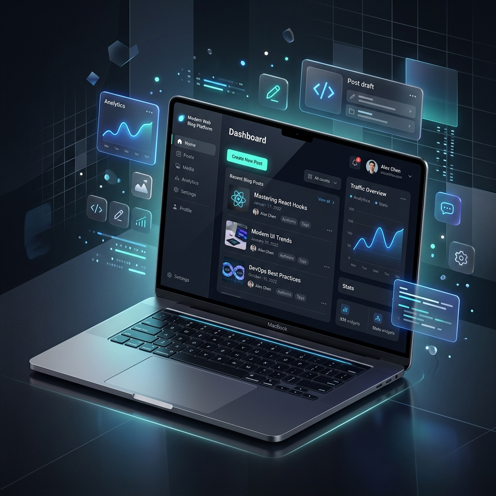
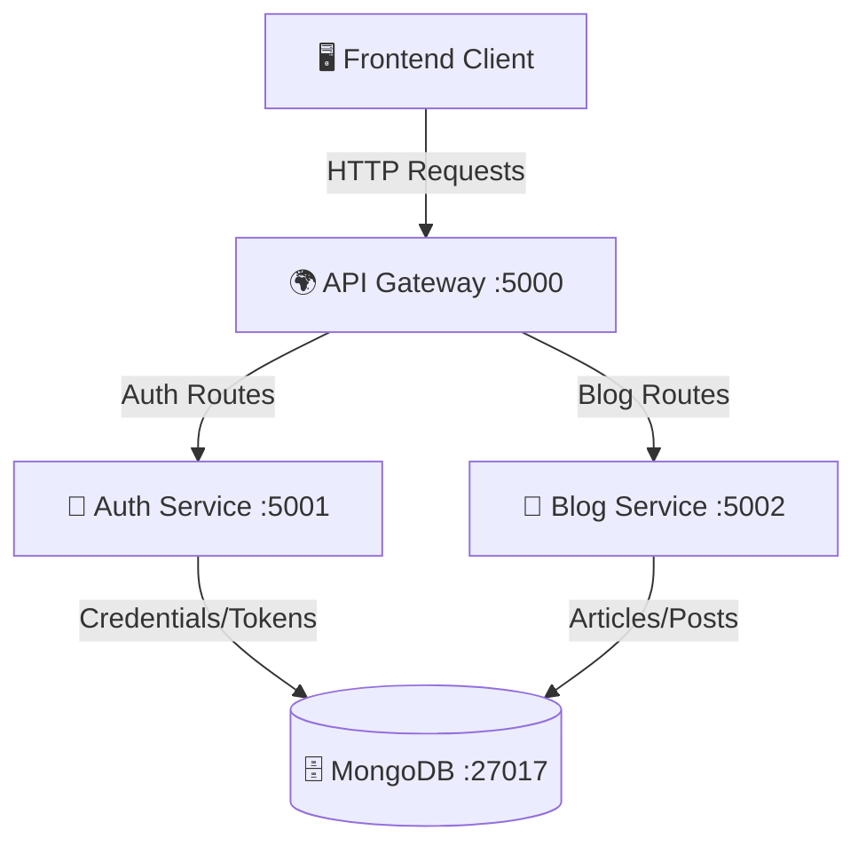

<div align="center">
  
  <h1>✨ Modern Web Blog Platform ✨</h1>
  <p>A high-performance, full-stack blog application built with React, Node.js, and a scalable Microservices Architecture.</p>

  <!-- Badges -->
  <p>
    
    
    
    
    
  </p>
</div>

---

## 🌟 Overview

Welcome to the **Modern Web Blog Platform**. This project showcases a robust, production-ready implementation of a modern blogging engine. Engineered for scalability and performance, it leverages a sleek React-based client and a highly modular microservices backend orchestration. Perfect as a foundation for scalable content delivery networks or massive multi-user blogging environments.

## 🚀 Key Features

* **Microservices Architecture:** Independently scalable and maintainable backend services.
* **Centralized API Gateway:** A single entry point that seamlessly routes internal microservices.
* **Robust Authentication:** Secure, token-based authentication handled by a dedicated Auth Service.
* **Modern UI/UX:** Responsive, lightning-fast interfaces crafted with React 19 and Tailwind CSS v4.
* **Dockerized Environment:** Instant, foolproof setup using Docker and Docker Compose.
* **Containerized Database:** Integrated MongoDB for persistent, reliable, and scalable content storage.

---

## 🛠️ Technology Stack

### Frontend Client (`Front/`)
Built for speed, maintainability, and aesthetic appeal.
* **Core:** React 19 (managed via Vite)
* **Styling:** Tailwind CSS v4 for utility-first responsive design
* **Routing:** React Router v7
* **Assets:** Lucide React for crisp, scalable iconography

### Backend Services (`api/`)
A distributed system ensuring high availability and fault tolerance.
* **API Gateway (`:5000`):** Acts as the reverse proxy for all client requests.
* **Auth Service (`:5001`):** Centralized identity and access management.
* **Blog Service (`:5002`):** Core logic for CRUD operations on articles and posts.
* **Database (`:27017`):** MongoDB for distributed NO-SQL data persistence.

---

## 🏗️ System Architecture



---

## 🚦 Getting Started

### Prerequisites
Before you begin, ensure you have the following installed:
* [Node.js](https://nodejs.org/) (v18 or higher recommended)
* [Docker](https://www.docker.com/) and [Docker Compose](https://docs.docker.com/compose/)
* [Git](https://git-scm.com/)

### 1️⃣ Setting up the Backend (Docker Recommended)
We use Docker to effortlessly spin up our microservices and database.

```bash
# Navigate to the backend directory
cd api

# Boot up the network, databases, and microservices in isolated containers
docker-compose up -d --build
```
> **Note:** The backend API Gateway will be instantly accessible at `http://localhost:5000`. You can stop all services anytime via `docker-compose down`.

### 2️⃣ Setting up the Frontend
Once the backend is humming, launch your interactive client.

```bash
# Navigate to the frontend directory
cd ../Front

# Install modern dependencies
npm install

# Start the blazingly fast Vite development server
npm run dev
```

---

## 📂 Project Structure

```text
📦 Blog-Web-Project
 ┣ 📂 Front               # React Client Application
 ┃ ┣ 📂 src               # Source code, components, contexts, and pages
 ┃ ┣ 📂 public            # Static assets
 ┃ ┗ 📜 package.json      # Client dependencies
 ┗ 📂 api                 # Microservices Backend Infrastructure
   ┣ 📂 api-gateway       # Central routing logic
   ┣ 📂 auth-service      # JWT Authentication & User logic
   ┣ 📂 blog-service      # Post creation & retrieval logic
   ┣ 📜 docker-compose.yml # Docker orchestration file
   ┗ 📜 test-api.js       # Integration testing scripts
```

---

## 🤝 Contributing

We believe in the power of open collaboration! If you want to contribute to this project:
1. **Fork** the repository.
2. **Create a Feature Branch** (`git checkout -b feature/AmazingFeature`).
3. **Commit your Changes** (`git commit -m 'Add some AmazingFeature'`).
4. **Push to the Branch** (`git push origin feature/AmazingFeature`).
5. **Open a Pull Request**.

---

<div align="center">
  <b>Engineered with ❤️ for performance, scalability, and developer experience.</b>
</div>
